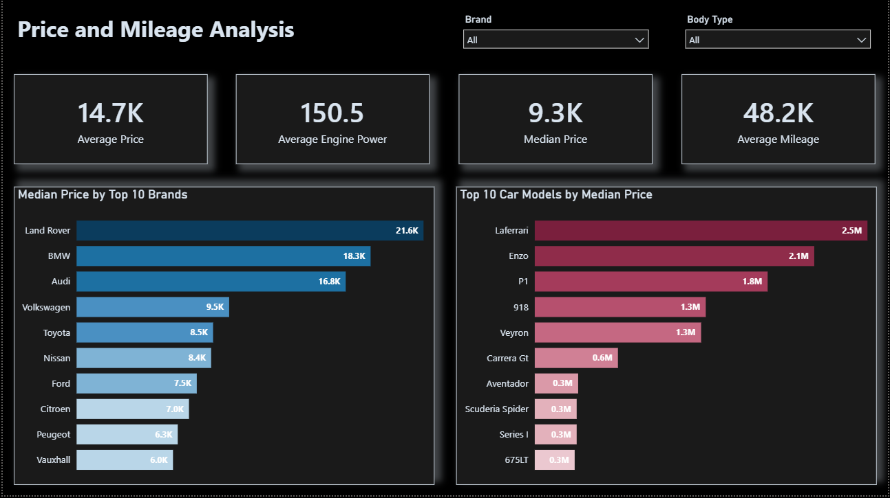
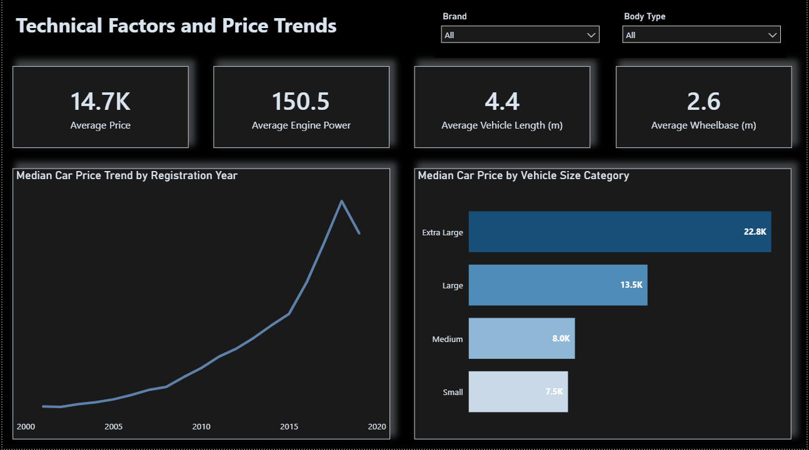

# Automotive Listings and Pricing Analysis in Power BI

## Project Overview

This project presents an interactive Power BI analysis of approximately 268,000 vehicle-listing records across 70 automotive brands.

The report was developed to examine the composition of the dataset, compare listed prices across brands and models, and evaluate how registration year and vehicle size are associated with price. The final solution includes three interactive report pages supported by Power Query transformations, DAX measures, conditional formatting, page-level slicers, and cross-filtering interactions.

The findings describe patterns in the available listings. They should not be interpreted as official sales volume, market share, transaction prices, or customer demand.

## Business Questions

The analysis was designed around the following questions:

- Which brands have the largest representation in the dataset?
- How are the listings distributed across reported brand-origin countries?
- How does median price differ among the most frequently listed brands?
- Which vehicle models have the highest median listed prices?
- How does median price vary by registration year?
- Is vehicle size associated with a higher median price?
- Which descriptive indicators provide the clearest overview of price, mileage, engine power, and vehicle dimensions?

## Data Source

The project was developed using a vehicle-listing dataset provided as part of a data analytics assignment.

The source dataset originally contained 25 fields. After data preparation, 22 fields were retained in the analytical model.

The original dataset is not redistributed in this repository. The source files did not clearly document the currency or engine-power units, so those values are presented in their original source units. Vehicle length and wheelbase were interpreted as millimeters based on their value ranges and were converted to meters for dashboard presentation.

## Dataset Coverage

The source data includes information about:

- Brand and vehicle model
- Reported manufacturing or brand-origin country
- Advertisement identifier
- Production and registration year
- Body type
- Mileage
- Engine size and engine power
- Transmission and fuel type
- Listed price and tax amount
- Wheelbase and vehicle dimensions
- Fuel-efficiency information
- Top speed, seat count, and door count

The geographic field is treated as a brand-origin attribute. It does not identify the exact production location of each individual vehicle or the market in which the vehicle was advertised or sold.

## Data Preparation and Quality Checks

Power Query and the Power BI semantic model were used to prepare the data for analysis. The main steps included:

- Reviewing and correcting column data types
- Removing unnecessary spaces and standardizing text values
- Renaming fields into clear English business terms
- Reviewing malformed or inconsistent vehicle-model values
- Checking the logical consistency between brands and their reported countries of origin
- Correcting identified brand-country inconsistencies using conditional logic
- Handling invalid or missing values in analytical fields
- Creating a vehicle-size category based on vehicle length
- Converting vehicle length and wheelbase from millimeters to meters for dashboard presentation
- Reviewing the effect of high-value listings on average price
- Creating reusable DAX measures for KPIs, rankings, and conditional formatting

During data validation, a brand-country inconsistency was identified: Peugeot records were assigned to the United States. This issue was corrected using conditional logic.

A complete brand-to-country reference table was not implemented for all brands. For that reason, country-level results should still be interpreted with caution. Building a dedicated brand-origin dimension table is recommended as a future improvement.

## Analytical Model and DAX Measures

The report uses a single analytical table named `Cars`.

The main DAX measures include:

- `Total Vehicles`
- `Total Brands`
- `Average Price`
- `Median Price`
- `Average Mileage`
- `Average Engine Power`
- `Average Vehicle Length (m)`
- `Average Wheelbase (m)`
- `Average Tax Amount`
- `Brand Rank by Median Price`
- `Body Type Rank by Median Price`
- Conditional color measures for brands, models, body types, vehicle-size categories, and countries

Median price was selected as the main comparison measure because the price distribution is strongly right-skewed. A small number of very expensive listings increase the average substantially, while the median provides a more representative central value for a typical listing.

## Dashboard Pages

### 1. Global Car Market Overview


This page provides a high-level view of the dataset through:

- Total listing count
- Total number of brands
- Median listed price
- Average mileage
- Top 10 brands by number of listings
- Listing distribution by reported brand-origin country
- Interactive filters for brand and country

### 2. Price and Mileage Analysis



This page focuses on price differences across major brands and individual models:

- Average listed price
- Median listed price
- Average engine power
- Average mileage
- Median-price comparison among the 10 most frequently listed brands
- Top 10 vehicle models by median listed price
- Interactive filters for brand and body type

### 3. Technical Factors and Price Trends



This page evaluates price patterns in relation to registration year and vehicle size:

- Average listed price
- Average engine power
- Average vehicle length in meters
- Average wheelbase in meters
- Median-price trend by registration year
- Median price by vehicle-size category
- Interactive filters for brand and body type

## Key Findings

### Dataset Composition

Ford has the largest number of listings in the dataset with approximately 26.9K records. Audi, Vauxhall, Volkswagen, and BMW follow with approximately 22.5K, 20.2K, 18.0K, and 17.2K listings respectively.

This concentration shows that the dataset is not evenly distributed across brands. A limited group of manufacturers accounts for a substantial share of the available records.

Country-level results should be interpreted only after brand-country inconsistencies have been reviewed. The related chart reflects listing distribution by reported brand origin, not sales performance or customer demand in those countries.

### Price Distribution

The overall average listed price is approximately 14.7K, while the median is approximately 9.3K.

The difference between these values indicates a right-skewed price distribution. A relatively small number of highly priced listings raises the average, making the median a more reliable measure for comparing brands and models.

Among the 10 most frequently listed brands, Land Rover has the highest median price at approximately 21.6K. BMW and Audi follow at approximately 18.3K and 16.8K.

### High-Value Models

High-value performance and luxury models dominate the top-model ranking. LaFerrari, Enzo, P1, 918, and Veyron have exceptionally high median prices compared with the overall dataset.

These rankings should be interpreted carefully because some models may have a limited number of listings. Median price should ideally be reviewed together with listing count before drawing commercial conclusions.

### Registration Year and Price

Median listed price generally increases across more recent registration years.

The decline in the final year should not automatically be interpreted as a market-wide price reduction. It may reflect a smaller sample, a different mix of brands and models, or incomplete data for that year.

The chart compares different groups of vehicles by registration year. It does not track the price of the same vehicle over time.

### Vehicle Size and Price

Median listed price increases across the vehicle-size categories:

- Small: approximately 7.5K
- Medium: approximately 8.0K
- Large: approximately 13.5K
- Extra Large: approximately 22.8K

This pattern indicates a positive association between vehicle size and listed price. However, vehicle size should not be treated as the sole cause of price differences.

Brand, model, registration year, body type, mileage, engine power, equipment level, and market segment may influence the same relationship.

## Analytical Limitations

The following limitations should be considered when interpreting the report:

- Listing count does not necessarily represent actual sales volume or official market share.
- The dataset does not include the location in which each vehicle was advertised or sold.
- The country field should be treated as a reported brand-origin attribute rather than an exact production location.
- A complete brand-origin mapping table was not implemented for every brand.
- Some high-value models may have small sample sizes.
- Listed price may differ from final transaction price.
- Currency and engine-power units were not explicitly documented in the source files.
- The dashboards show associations, not causal effects.
- A multivariable pricing model would be required to estimate the independent effect of registration year, mileage, size, brand, and technical specifications.

## Tools and Technologies

- Microsoft Power BI
- Power Query
- DAX
- Microsoft Excel
- Data cleaning and validation
- Interactive dashboard design
- Conditional formatting
- Descriptive and comparative analysis

## Repository Structure

```text
global-car-market-analysis/
│
├── README.md
├── dashboard/
│   └── global-car-market-analysis.pbix
└── images/
    ├── global-market-overview.png
    ├── price-and-mileage-analysis.png
    └── technical-factors-and-price-trends.png
```


## How to Use the Report

1. Download `global-car-market-analysis.pbix` from the `dashboard` folder.
2. Open the file in Power BI Desktop.
3. Use the page-level slicers to filter the report by brand, body type, or reported country of origin.
4. Select chart elements to cross-filter related visuals on the same page.
5. Interpret model-level rankings with caution when a model has a limited number of listings.

## Recommended Future Improvements

- Build a dedicated brand-origin dimension table
- Validate the reported country for every brand
- Add listing count to the tooltip of the model-price chart
- Introduce mileage bands and vehicle-age bands
- Compare prices within equivalent body-type and registration-year groups
- Create a multivariable regression model for price estimation
- Add data-quality indicators for missing, corrected, and unmatched values
- Publish a Power BI Service version with a public portfolio link, where appropriate

## Author

**Mahsa Kazempour**  
Data Analyst
